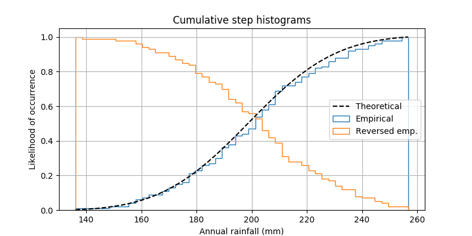

---
jupytext:
  text_representation:
    extension: .md
    format_name: myst
    format_version: 0.13
    jupytext_version: 1.10.3
kernelspec:
  display_name: Python 3
  language: python
  name: python3
---

# NumPy / SciPy Quiz

Please do explore beyond the problems given, and feel free to ask questions at any time.

If you need a quick refresher on NumPy, have a look at
[this introduction](http://mentat.za.net/numpy/intro/intro.html).  Also see the [SciPy lectures](http://scipy-lectures.org/).

If you run out of exercises, there are [100 more here!](http://www.loria.fr/~rougier/teaching/numpy.100/)

```{code-cell} python
import numpy as np

%matplotlib inline
import matplotlib.pyplot as plt

import scipy
```

## The NumPy array

+++

- Create a `3x4` array containing the numbers from 0 through 11 (using `np.arange` and `np.reshape`), and call it `x`.

+++

- Predict whether `x` changes after executing the following:

```python
y = x[2]
y[0] = 3
```

+++

- Compute the sums of the columns of x, using `np.sum`.

+++

- Construct the array x = np.array([0, 1, 2, 3], dtype=np.uint8).  Predict the value of `x - 1`.

+++

## Broadcasting

+++

- Consider two arrays, `x = np.arange(5); y = np.array([0.5, 1.5])`.

  Construct a `5x2` matrix such that
  `A[i, j] = x[i] * y[j]`, without using for-loops.

+++

- Given a list of XYZ-coordinates, ``p``,

  ```
  [[1.0, 2.0, 10],
   [3.0, 4.0, 20],
   [5.0, 6.0, 30],
   [7.0, 8.0, 40]]
  ```

  Normalise each coordinate by dividing with its Z (3rd) element. For example,
  the first row becomes:

  ```
  [1/10, 2/10, 10/10]
  ```

  **Hint:** extract the last column into a variable ``z``, and then change its dimensions so
  that ``p / z`` works.

+++

## Indexing

+++

- Create a ``3x3`` ndarray, `A = np.array([[0, 1, 2], [1, 1, 3], [2, 3, 2]])`.  Find an indexing expression for extracting the diagonal elements, i.e.

  `delems = A[...]`

+++

- Generate a 10 x 3 array of random numbers (all between 0 and 1). From each row, pick
the number closest to 0.75. Make use of ``np.abs`` and ``np.argmax`` to find the
column ``j`` which contains the closest element in each row.

+++

- Predict and verify the shape of the following slicing operation.

```python
x = np.empty((10, 8, 6))

idx0 = np.zeros((3, 8)).astype(int)
idx1 = np.zeros((3, 1)).astype(int)
idx2 = np.zeros((1, 1)).astype(int)

x[idx0, idx1, idx2]
```

+++

## Optimization

+++

Consider the Rosenbrock test function.  You can visualize it by executing the following cell:

```{code-cell} python
# From https://commons.wikimedia.org/wiki/File:Rosenbrock_function.svg

from mpl_toolkits.mplot3d import Axes3D
from matplotlib import cm
from matplotlib.colors import LogNorm
import matplotlib.pyplot as plt
import numpy as np

def rosenbrock(x, y):
    return (1 - x)**2 + 100 * (y - x**2)**2

fig = plt.figure()
ax = Axes3D(fig, azim = -128, elev = 43)
s = .05
X = np.arange(-2, 2.+s, s)
Y = np.arange(-1, 3.+s, s)
X, Y = np.meshgrid(X, Y)
Z = rosenbrock(X, Y)
# ax.plot_surface(X, Y, Z, rstride = 1, cstride = 1, norm = LogNorm(), cmap = cm.jet)
# Without using `` linewidth=0, edgecolor='none' '', the code may produce a graph with wide black edges, which 
# will make the surface look much darker than the one illustrated in the figure above.
ax.plot_surface(X, Y, Z, rstride = 1, cstride = 1, norm = LogNorm(), cmap = cm.viridis, linewidth=0, edgecolor='none')

# Set the axis limits so that they are the same as in the figure above.
ax.set_xlim([-2, 2.0])                                                       
ax.set_ylim([-1, 3.0])                                                       
ax.set_zlim([0, 2500]) 

plt.xlabel("x")
plt.ylabel("y");
```

Find the *minimum* of the test function `rosenbrock` defined above.  Use `scipy.optimize.minimize`, and the following template:

```{code-cell} python
from scipy import optimize

def cost_f(p):
    x, y = p
    return rosenbrock(x, y)
```

## Plotting

+++

Generate some random data using:

```
np.random.seed(0)

mu = 200
sigma = 25
n_bins = 50
x = np.random.normal(mu, sigma, size=100)
```

Now, try to reproduce this plot:



+++

## ndimage

+++

Use `scipy.ndimage.distance_transform_edt` to calculate the distance map of the image generated in the next cell:

```{code-cell} python
from skimage import draw

N = 200
S = 10

np.random.seed(0)
image = np.ones((N, N), dtype=bool)

coords = np.random.randint(low=0, high=N, size=4 * S).reshape(-1, 4)

for line in coords:
    image[draw.line(*line)] = 0
```

Display the distance map; can you interpret what you see?

+++

## interpolation

+++

An image is sampled `T` times by the code below.  Take the coordinates and values of the samples, and
try to reconstruct the original image.  **Hint:** Use `scipy.interpolate.griddata`, and provide it with the coordinates of the full image, generated using `np.indices`.

```{code-cell} python
from skimage import data, color, filters
image = color.rgb2gray(data.astronaut())
image = filters.gaussian(image, sigma=2)

M, N = image.shape

T = 5000  # nr of randomly drawn samples
coords = np.column_stack([
    np.random.randint(0, M, size=T),
    np.random.randint(0, N, size=T)
])


# Use `coords` and `samples` to reconstruct the image
coords = tuple(coords.T)
samples = image[coords]
```

We can visualize the data below, to see how densely the image was sampled:

```{code-cell} python
# Visualize sampling

sampled_image = np.zeros_like(image)
sampled_image[coords] = image[coords]

f, (ax0, ax1) = plt.subplots(1, 2, figsize=(20, 10))
ax0.imshow(image, cmap='gray')
ax1.imshow(sampled_image, cmap='gray');
```
