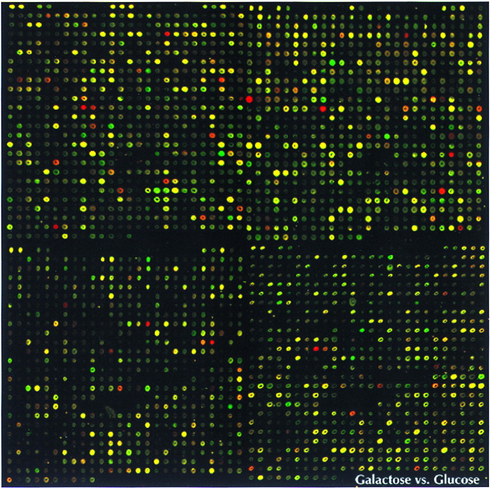

---
jupytext:
  text_representation:
    extension: .md
    format_name: myst
    format_version: 0.13
    jupytext_version: 1.11.2
kernelspec:
  display_name: Python 3
  language: python
  name: python3
---

```{code-cell} ipython3
from __future__ import division, print_function
%matplotlib inline
```

# DNA microarray processing

### Data in this example

*Yeast microarrays for genome wide parallel genetic and gene
expression analysis*



Two-color fluorescent scan of a yeast microarray containing 2,479 elements
(ORFs). The center-to-center distance between elements is 345 μm. A probe
mixture consisting of cDNA from yeast extract/peptone (YEP) galactose (green
pseudocolor) and YEP glucose (red pseudocolor) grown yeast cultures was
hybridized to the array. Intensity per element corresponds to ORF expression,
and pseudocolor per element corresponds to relative ORF expression between the
two cultures. 

by Deval A. Lashkari, http://www.pnas.org/content/94/24/13057/F1.expansion

<div style="clear: both;"></div>
<br/>
Learn more about microarrays:

- [Tutorial on how to analyze microarray data](http://www.hhmi.org/biointeractive/how-analyze-dna-microarray-data)
- [Complementary DNA](http://en.wikipedia.org/wiki/Complementary_DNA)

More example data:

- [MicroArray Genome Imaging & Clustering Tool](http://www.bio.davidson.edu/projects/MAGIC/MAGIC.html) by Laurie Heyer & team, Davidson College

```{code-cell} ipython3
import matplotlib.pyplot as plt

import numpy as np

from skimage import io, img_as_float
```

```{code-cell} ipython3
microarray = io.imread('../images/microarray.jpg')

# Scale between zero and one
microarray = img_as_float(microarray)

plt.figure(figsize=(10, 5))
plt.imshow(microarray[:500, :1000], cmap='gray', interpolation='nearest');
```

```{code-cell} ipython3
from skimage import color
f, (ax0, ax1) = plt.subplots(1, 2, figsize=(15, 10))

red = microarray[..., 0]
green = microarray[..., 1]

red_rgb = np.zeros_like(microarray)
red_rgb[..., 0] = red

green_rgb = np.zeros_like(microarray)
green_rgb[..., 1] = green

ax0.imshow(green_rgb, interpolation='nearest')
ax1.imshow(red_rgb, interpolation='nearest')
plt.suptitle('\n\nPseudocolor plots of red and green channels', fontsize=16);
```

```{code-cell} ipython3
from skimage import filters

mask = (green > 0.1)
plt.imshow(mask[:1000, :1000], cmap='gray');
```

```{code-cell} ipython3
z = red.copy()
z /= green
z[~mask] = 0

print(z.min(), z.max())

plt.imshow(z[:500, :500], cmap=plt.cm.gray, vmin=0, vmax=2);
```

### Locating the grid

```{code-cell} ipython3
both = (green + red)

plt.imshow(both, cmap='gray');
```

```{code-cell} ipython3
from skimage import feature

sum_down_columns = both.sum(axis=0)
sum_across_rows = both.sum(axis=1)

dips_columns = feature.peak_local_max(sum_down_columns.max() - sum_down_columns, min_distance=5)
dips_columns = np.sort(dips_columns.ravel())

M = len(dips_columns)
column_distance = np.mean(np.diff(dips_columns))

dips_rows = feature.peak_local_max(sum_across_rows.max() - sum_across_rows, min_distance=5)
dips_rows = np.sort(dips_rows.ravel())

N = len(dips_rows)
row_distance = np.mean(np.diff(dips_rows))

print('Columns are a mean distance of %.2f apart' % column_distance)
print('Rows are a mean distance of %.2f apart' % row_distance)

f, (ax0, ax1) = plt.subplots(1, 2, figsize=(15, 5))

ax0.plot(sum_down_columns)
ax0.scatter(dips_columns, sum_down_columns[dips_columns])
ax0.set_xlim(0, 200)
ax0.set_title('Column gaps')

ax1.plot(sum_across_rows)
ax1.scatter(dips_rows, sum_across_rows[dips_rows])
ax1.set_xlim(0, 200)
ax0.set_title('Row gaps');
```

```{code-cell} ipython3
P, Q = 500, 500

plt.figure(figsize=(15, 10))
plt.imshow(microarray[:P, :Q])

for i in dips_rows[dips_rows < P]:
    plt.plot([0, Q], [i, i], 'm')

for j in dips_columns[dips_columns < Q]:
    plt.plot([j, j], [0, P], 'm')

plt.axis('image');
```

```{code-cell} ipython3
out = np.zeros(microarray.shape[:2])
M, N = len(dips_rows), len(dips_columns)

for i in range(M - 1):
    for j in range(N - 1):
        row0, row1 = dips_rows[i], dips_rows[i + 1]
        col0, col1 = dips_columns[j], dips_columns[j + 1]

        r = microarray[row0:row1, col0:col1, 0]
        g = microarray[row0:row1, col0:col1, 1]

        ratio = r / g
        mask = ~np.isinf(ratio)

        mean_ratio = np.mean(ratio[mask])
        if np.isnan(mean_ratio):
            mean_ratio = 0
        
        out[row0:row1, col0:col1] = mean_ratio
```

```{code-cell} ipython3
f, (ax0, ax1) = plt.subplots(1, 2, figsize=(15, 10))

ax0.imshow(microarray)
ax0.grid(color='magenta', linewidth=1)

ax1.imshow(out, cmap='gray', interpolation='nearest', vmin=0, vmax=3);
ax1.grid(color='magenta', linewidth=1)
```

### Transform the intensity to spot outliers

```{code-cell} ipython3
from skimage import exposure

f, (ax0, ax1) = plt.subplots(1, 2, figsize=(15, 10))

ax0.imshow(microarray)
ax0.grid(color='magenta', linewidth=1)

ax1.imshow(exposure.adjust_log(out, gain=0.4), cmap='gray', interpolation='nearest', vmin=0, vmax=3);
ax1.grid(color='magenta', linewidth=1)
```
