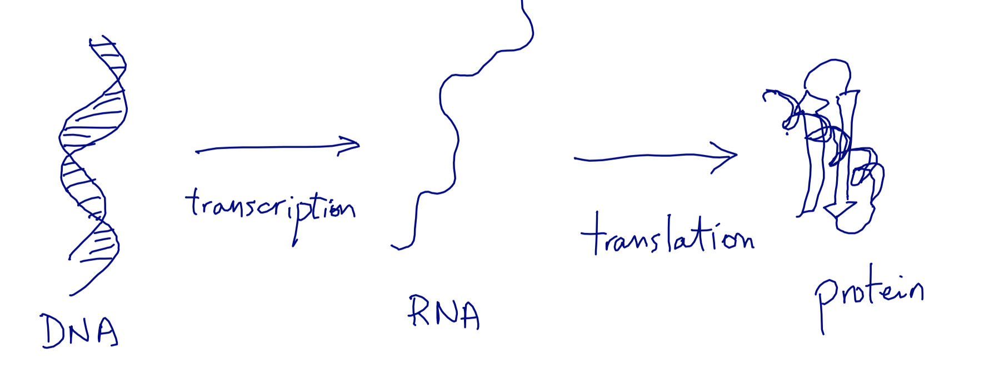
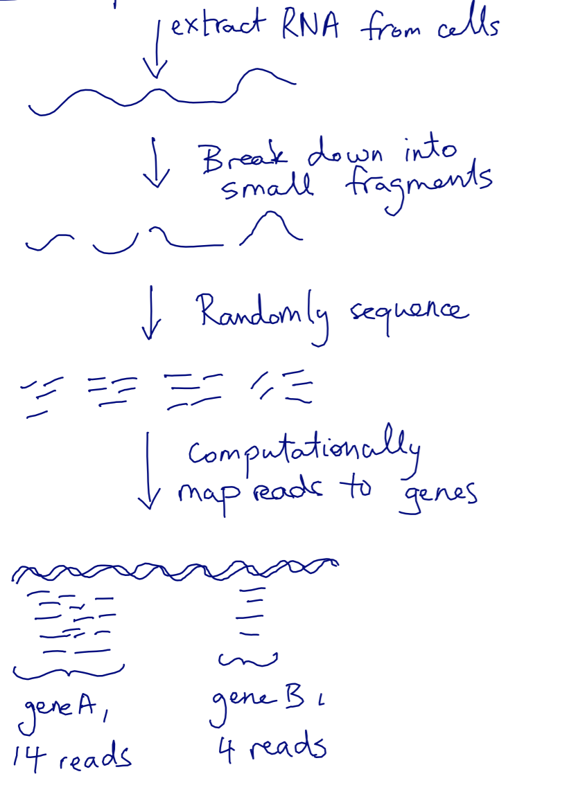

# Advanced NumPy

```python
%matplotlib inline
```

## Quick example: gene expression, without numpy

FIRST...

## Even quicker: what is gene expression?

How genes work:



What this means:


How we measure it:



## Some fake data

|        | Cell type A | Cell type B | Cell type C | Cell type D |
|--------|-------------|-------------|-------------|-------------|
| Gene 0 | 100         | 200         | 50          | 400         |
| Gene 1 | 50          | 0           | 0           | 100         |
| Gene 2 | 350         | 100         | 50          | 200         |


```python
gene0 = [100, 200, 50, 400]
gene1 = [50, 0, 0, 100]
gene2 = [350, 100, 50, 200]
expression_data = [gene0, gene1, gene2]
```

Why is this a bad idea?

## Now with NumPy


```python
import numpy as np
a = np.array(expression_data)
print(a)
```

We are going to:

* Obtain an *RPKM* expression matrix
* Quantile normalize the data

using the awesome power of NumPy

## Inside a numpy ndarray


```python
def print_info(a):
    print('number of elements:', a.size)
    print('number of dimensions:', a.ndim)
    print('shape:', a.shape)
    print('data type:', a.dtype)
    print('strides:', a.strides)
    print('flags:', a.flags)
    
print_info(a)
```


```python
print(a.data)
```


```python
abytes = a.ravel().view(dtype=np.uint8)
```


```python
print_info(abytes)
```


```python
print(abytes[:24])
```

### Example: take the transpose of `a`


```python
print_info(a)
```


```python
print_info(a.T)
```

### Example: skipping rows and columns with *slicing*


```python
print_info(a.T)
```


```python
print_info(a.T[::2])
```


```python
print_info(a.T[::2, ::2])
```

### Getting a copy


```python
b = a
```


```python
print(b)
```


```python
a[0, 0] = 5
print(b)
a[0, 0] = 100
```

## Advanced operations: axis-wise evaluation


```python
expr = np.load('../../data/expr.npy')
```


```python
print_info(expr)
```

This has the raw read count data. However, each sample gets a different number of reads, so we want to normalize by the *library size*, which is the total number of reads across a column.

The `np.sum` function returns the sum of all the elements of an array. With the `axis` argument, you can take the sum *along the given axis*.


```python
lib_size = np.sum(expr, axis=0)
print(lib_size)
```

### Exercise

Generate a 10 x 3 array of random numbers. From each row, pick the number closest to 0.75. Make use of np.abs and np.argmax to find the column j which contains the closest element in each row.


```python

```

## Advanced operations: broadcasting

In order to normalize every column by its corresponding library size, we have to *align* the two arrays' axes: each dimension must be either the same size, or one of the arrays must have size 1. Use `np.newaxis` to match the dimensions.


```python
print(expr.shape)
print(lib_size.shape)
print(lib_size[np.newaxis, :].shape)
```

However, NumPy will automatically prepend singleton dimensions until the array shapes match or there is an error:


```python
np.all(expr / lib_size ==
       expr / lib_size[np.newaxis, :])
```


```python
expr_lib = expr / lib_size
```

We also multiply by $10^6$ in order to keep the numbers on a readable scale (reads per million reads).


```python
expr_lib *= 1e6
```

Finally, longer genes are more likely to produce reads. So we normalize by the gene length (in kb) to produce a measure of expression called Reads Per Kilobase per Million reads (RPKM).


```python
gene_len = np.load('../../data/gene-lens.npy')
print(gene_len.shape)
```

### Exercise: broadcast `expr_lib` and `gene_len` together to produce RPKM


```python
rpkm = expr_lib  # FIX THIS
```


```python
import matplotlib.pyplot as plt
from scipy import stats

def plot_col_density(data, xlim=None, *args, **kwargs):
    # Use gaussian smoothing to estimate the density
    density_per_col = [stats.kde.gaussian_kde(col) for col in data.T]
    if xlim is not None:
        m, M = xlim
    else:
        m, M = np.min(data), np.max(data)
    x = np.linspace(m, M, 100)

    fig, ax = plt.subplots()
    for density in density_per_col:
        ax.plot(x, density(x), *args, **kwargs)
    ax.set_xlabel('log-counts')
    ax.set_ylabel('frequency')
    if xlim is not None:
        ax.set_xlim(xlim)
    plt.show()

```


```python
%matplotlib inline
```


```python
plt.style.use('ggplot')
```


```python
plot_col_density(np.log(expr+1)[:, :20])
```


```python
plot_col_density(np.log(rpkm + 1)[:, :20], xlim=(0, 250))
```

### Exercise: 3D broadcasting

Below, produce the array containing the sum of every element in `x` with every element in `y`


```python
x = np.random.rand(3, 5)
y = np.random.randint(10, size=8)
z = x # FIX THIS
```

## Fancy indexing

You can index arrays with slicing, but also with boolean arrays (including broadcasting!), integer arrays, and individual indices along multiple dimensions.


```python
values = np.array([0, 5, 99])
selector = np.random.randint(0, 3, size=(3, 4))
print(selector)
print(values[selector])
```

### Exercise: quantile normalization

Quantile Normalization(https://en.wikipedia.org/wiki/Quantile_normalization) is a method to align distributions. Implement it using NumPy axis-wise operations and fancy indexing.

*Hint: look for documentation for `scipy.mstats.rankdata`, `np.sort`, and `np.argsort`.*


```python
def qnorm(x):
    """Quantile normalize an input matrix.
    
    Parameters
    ----------
    x : 2D array of float, shape (M, N)
        The input data, with each column being a
        distribution to normalize.
        
    Returns
    -------
    xn : 2D array of float, shape (M, N)
        The normalized data.
    """
    xn = np.copy(x) # replace this by normalizing code
    return xn
```


```python
logexpr = np.log(expr + 1)
logrpkm = np.log(rpkm + 1)
```


```python
logexprn = qnorm(logexpr)
logrpkmn = qnorm(logrpkm)
```


```python
plot_col_density(logexprn[:, :20])
```


```python
plot_col_density(logrpkmn[:, :20], xlim=(0, 0.25))
```
