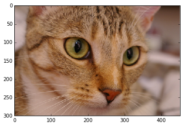
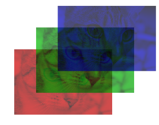
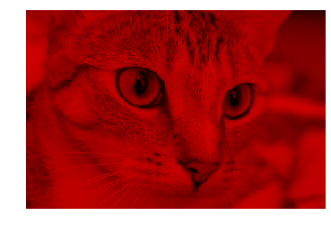
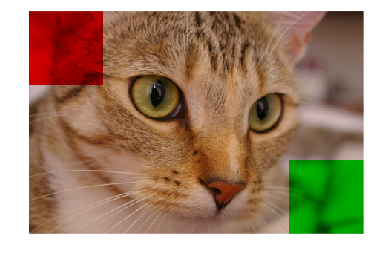
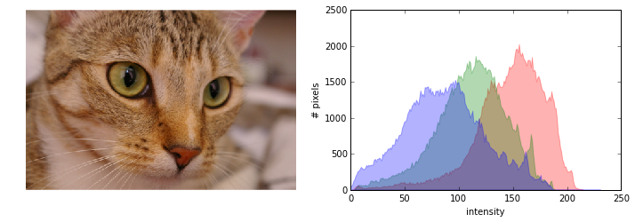
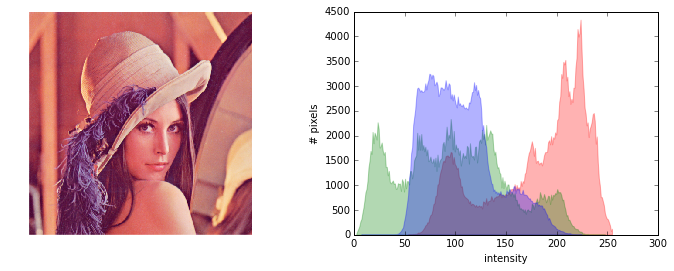
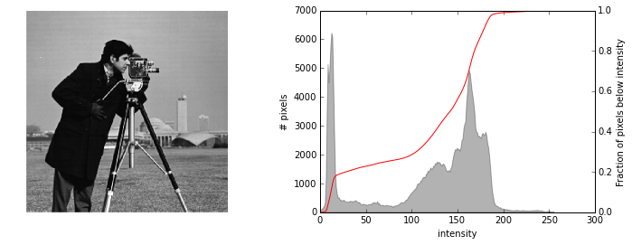
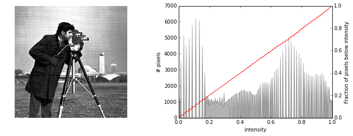
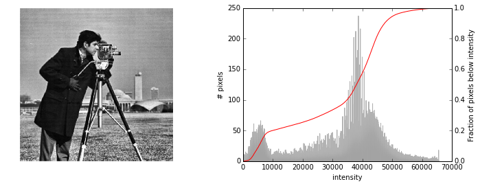

# Color and exposure

### Color images have a 3rd dimension

We'll be using a custom module with some helper functions for this tutorial.
Make sure you have access to `skdemo.py`, which should have be included with
these notebooks.

    import skdemo
    #skdemo.  # <TAB>

Color images are arrays with pixel rows and columns as the first two dimensions
(just like a gray-scale image), plus a 3rd dimension that describes the RGB
color channels:

    from skimage import data
    
    color_image = data.chelsea()
    skdemo.imshow(color_image, show_ticks=True)

    color_image.shape

    (300, 451, 3)

Here we have an image with a height of 300 px, a width of 451 px, and 3 color
channels, which are the red, green, and blue channels as displayed below:

    skdemo.imshow_rgb_shifted(color_image)

## Basic array manipulation

Since images are just arrays, we can manipulate them as we would any other
array.

### Slicing and indexing

Let's say we want to plot just the red channel of the color image above. We know
that the red channel is the first channel of the 3rd image-dimension. Since
Python is zero-indexed, we can write the following:

    red_channel = color_image[:, :, 0]

But if we plot this image...

    skdemo.imshow(red_channel)

Obviously that's not red at all. The reason is that there's nothing to tell us
that this array is supposed to be red: It's just a 2D array with a height,
width, and intensity value---and no color information.

    red_channel.shape

    (300, 451)

To show just the red channel, let's "erase" the green and blue channels, but
keep the 3rd dimension of the image:

    red_image = color_image.copy()
    red_image[:, :, 1:] = 0
    skdemo.imshow(red_image)

In the examples above, we just manipulate the last axis of the array (i.e. the
color channel). As with any NumPy array, however, slicing can be applied to each
axis:

    color_patches = color_image.copy()
    # Remove green (1) & blue (2) from top-left corner.
    color_patches[:100, :100, 1:] = 0
    # Remove red (0) & blue (2) from bottom-right corner.
    color_patches[-100:, -100:, (0, 2)] = 0
    skdemo.imshow(color_patches)

## Color spaces

RGB is one way to represent color images, but there are many different ways to
do so. You can easily convert to a different color representation, or "color
space", using functions in the `color` module:

    from skimage import color
    #color.rgb2  # <TAB>

While RGB is fairly easy to understand, using it to detect a specific color
(other than red, green, or blue) can be a pain. Many of the other color spaces
devote a single component to the image intensity (a.k.a. luminance or lightness)
and often have two more components to represent the color.

Here, we'll look at the Lab (or CIELAB) color space:

    from skimage import color
    
    lab_image = color.rgb2lab(color_patches)
    lab_image.shape

    (300, 451, 3)

Converting to Lab didn't change the shape of the image at all. Let's try to plot
it:

    import matplotlib.pyplot as plt
    
    plt.imshow(lab_image);

Matplotlib expected an RGB array, and apparently, Lab arrays don't look anything
like RGB arrays.

## Exercise:

Use the CIELAB color space to isolate the red and green patches in the
`color_patches` image. Play around with the individual components to get a feel
for what they do and see the [wikipedia
page](http://en.wikipedia.org/wiki/Lab_colorspace) for more info.

## Histograms

Histograms are a quick way to get feel for the global statistics of the image
intensity. They can tell you where to set a threshold and how to adjust the
contrast, and they would have probably useful on the exercise you just completed
;)

You might be inclined to plot a histogram using matplotlib's `hist` function:

    #plt.hist(color_image);

That didn't work as expected. How would you fix the call above to make it work
correctly?

### Histograms of images

For this tutorial, we're going to use a custom plotting function, does a few
nice things for us:
* Plot the image next to the histogram
* Plot each RGB channel separately
* Automatically flatten channels
* Select reasonable bins based on the image's `dtype`

    skdemo.imshow_with_histogram?

Using this function, let's look at the histogram of a grayscale image:

    image = data.camera()
    skdemo.imshow_with_histogram(image);

Image intensity values are along the x-axis: Low-intensity values are closer to
black, and high-intensity values are closer to white. The y-axis gives the
number of pixels that are found at each intensity value.

You can see the sharp peak in the low range because of the man's black jacket.
And the rest of the image is fairly gray.

Now let's look at our color image:

    skdemo.imshow_with_histogram(color_image);

As you can see the intensity for each RGB channel is plotted separately. Unlike
the previous histogram, these histograms almost look like Gaussian distributions
that are shifted. This reflects the fact that color/intensity changes are
relatively gradual in this picture.

Let's take a look at one more picture:

    skdemo.imshow_with_histogram(data.lena());

In this image, there are large patches of relatively uniform color, and these
patches are often separated by sharp transitions. This results in multi-modal
distributions and sharp transition regions.

Note: These RGB histograms are pretty, but not that useful, since a high red
value is very different if combined with a low green and blue values (the result
will tend toward red) vs high green and blue values (the result will tend toward
white).

### Histograms and contrast

Let's take another look at the gray-scale image from earlier:

    image = data.camera()
    skdemo.imshow_with_histogram(image);

Notice intensity values at the bottom. Since image has a `dtype` of `uint8`, the
values go from 0 to 255. Though you can see some pixels tail off toward 255, you
can clearly see in the histogram, and in the image, that we're not using the
high-intensity limits very well.

Based on the histogram values, you might want to take all the pixels values that
are more than about 180 in the image, and make them pure white (i.e. an
intensity of 255). While we're at it, values less than about 10 can be set to
pure black (i.e. 0). We can do this easily using `rescale_intensity`, from the
`exposure` subpackage.

    from skimage import exposure
    high_contrast = exposure.rescale_intensity(image, in_range=(10, 180))
    skdemo.imshow_with_histogram(high_contrast);

The contrast is visibly higher in the image, and the histogram is noticeably
stretched. The sharp peak on the right is due the all the pixels greater 180 (in
the original image) that were piled into a single bin (i.e. 255).

### Histogram equalization

In the previous example, grayscale values (10, 180) were set to (0, 255), and
everything in between was linearly interpolated. There are other strategies for
contrast enhancement---notably histogram equalization. Let's first look at the
cumulative distribution function (CDF) of the image intensities.

    ax_image, ax_hist = skdemo.imshow_with_histogram(image)
    skdemo.plot_cdf(image, ax=ax_hist.twinx())

For each intensity value, the CDF gives the fraction of pixels below that
intensity value.

One measure of contrast is how evenly distributed intensity values are: The dark
coat might contrast sharply with the background, but the tight distribution of
pixels in the dark coat mean that details in the coat are hidden. To enhance
contrast, we could spread out intensities that are tightly distributed and allow
intensities with only a few pixels to combine.

This redistribution is exactly what histogram equalization does. And the CDF is
important because a perfectly uniform distribution gives a CDF that's a straight
line. We can use `equalize_hist` from the `exposure` package to demonstrate:

    equalized = exposure.equalize_hist(image)

    ax_image, ax_hist = skdemo.imshow_with_histogram(equalized)
    skdemo.plot_cdf(equalized, ax=ax_hist.twinx())

The tightly distributed dark-pixels in the coat have been spread out, which
reveals many details in the coat that were missed earlier. As promised, this
more even distribution produces a CDF that approximates a straight line.

Unfortunately, histogram equalization tends to produce images whose contrast is
artificially high. In addition, better enhancement can be achieved locally by
looking at smaller patches of an image, rather than the whole image. In the
image above, the contrast in the coat is much improved, but the contrast in the
grass is somewhat reduced.

Contrast-limited adaptive histogram equalization (CLAHE) addresses these issues.
The implementation details aren't too important, but seeing the result is:

    equalized = exposure.equalize_adapthist(image)

    ax_image, ax_hist = skdemo.imshow_with_histogram(equalized)
    skdemo.plot_cdf(equalized, ax=ax_hist.twinx())

Compared to plain-old histogram equalization, the high contrast in the coat is
maintained, but the contrast in the grass is also improved.
Finally, the contrast doesn't look overly-enhanced, as it did with normal
histogram equalization.

### Histograms and thresholding

One of the most common uses for image histograms is thresholding. Let's return
to the original image and its histogram

    skdemo.imshow_with_histogram(image);

Here the man and the tripod are fairly close to black, and the rest of the scene
is mostly gray. But if you wanted to separate the two, how do you decide on a
threshold value just based on the image. Looking at histogram though, it's
pretty clear that a value of about 50 will separate the two large portions of
this image.

    ax_image, ax_hist = skdemo.imshow_with_histogram(image)
    threshold = 50
    # This is a bit of a hack that plots the thresholded image over the original.
    # This just allows us to reuse the layout defined in `plot_image_with_histogram`.
    ax_image.imshow(image > threshold)
    ax_hist.axvline(threshold, color='red');

Note that the histogram plotted here is for the image *before* thresholding.

This does a pretty good job of separating the man (and tripod) from most of the
background. Thresholding is the simplest method of image segmentation; i.e.
segmenting an image into "meaningful" regions. More on that later.

As you might expect, you don't have to look at a histogram to decide what a good
threshold value is: There are (many) algorithms that can do it for you. One of
the most popular is Otsu's method, which gives a slightly different threshold:

    from skimage import filter
    threshold = filter.threshold_otsu(image)
    print threshold

    skdemo.imshow(image > threshold)

Note the features of the man's face are slightly better resolved in this case.

## Further reading

* [Example of tinting gray-scale images](<http://scikit-
image.org/docs/dev/auto_examples/plot_tinting_grayscale_images.html>)
* Color spaces (see [`skimage.color`](http://scikit-
image.org/docs/dev/api/skimage.color.html) package)
  - `rgb2hsv`
  - `rgb2luv`
  - `rgb2xyz`
  - `rgb2lab`
* [Histogram equalization](http://scikit-
image.org/docs/dev/auto_examples/plot_equalize.html) and [local histogram
equalization](http://scikit-
image.org/docs/dev/auto_examples/plot_local_equalize.html)
