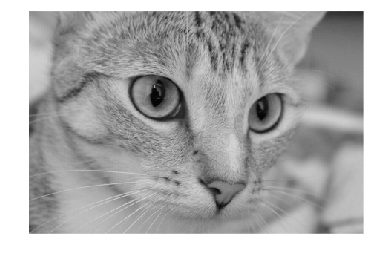
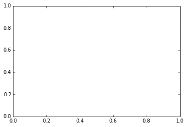
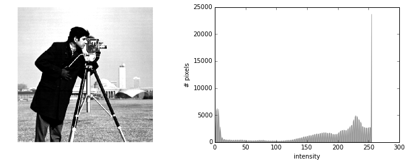
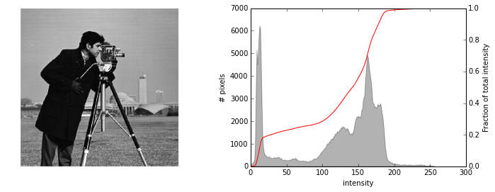
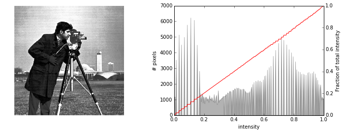
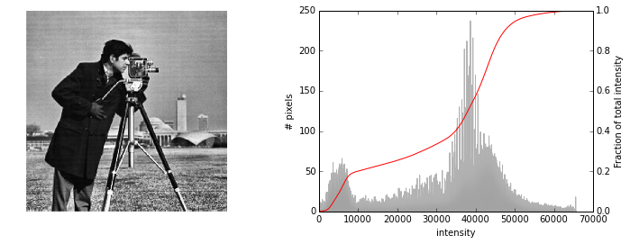
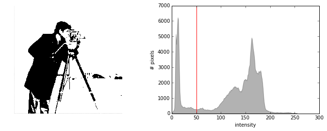

# Color and exposure

### Color images have a 3rd dimension

Color images have rows and columns as the first two dimensions (just like a
gray-scale image), plus a 3rd dimension that describes the RGB color channels:

    import skdemo
    reload(skdemo)
    from skimage import data
    
    color_image = data.chelsea()
    skdemo.imshow(color_image, show_ticks=True)

    print color_image.shape

    (300, 451, 3)

Here we have an image with a height of 300 px, a width of 451 px, and 3 color
channels.

    skdemo.imshow_rgb_shifted(color_image)

## Basic array manipulation

Since images are just arrays, we can manipulate them as we would any other
array.

### Slicing and indexing

Let's say we want to plot just the red channel of the color image above. We know
that the red channel is the first channel of the 3rd image-dimension. Since
Python is zero-indexed, we can write the following:

    red_channel = color_image[:, :, 0]

    skdemo.imshow(red_channel)

Obviously that's not red at all. The reason is that there's nothing to tell us
that this array is supposed to be red: It's just a 2D array with a height,
width, and intensity value---and no color information.

    print red_channel.shape

    (300, 451)

To show just the red channel, let's "erase" the green and blue channels, but
keep the 3rd dimension of the image:

    red_image = color_image.copy()
    red_image[:, :, 1:] = 0
    skdemo.imshow(red_image)

As with any NumPy array, slicing can be applied to each axis:

    color_patches = color_image.copy()
    # Remove green (1) & blue (2) from top-left corner.
    color_patches[:100, :100, 1:] = 0
    # Remove red (0) & blue (2) from bottom-right corner.
    color_patches[-100:, -100:, (0, 2)] = 0
    skdemo.imshow(color_patches)

## Color spaces

    from skimage import color
    
    lab_image = color.rgb2lab(color_patches)

    import matplotlib.pyplot as plt
    
    plt.imshow(lab_image);

## Exercise:

Use the CIELAB color space to isolate the red and green patches in the
`color_patches` image. (See [wikipedia
page](http://en.wikipedia.org/wiki/Lab_colorspace))

## Histograms

You might be inclined to plot a histogram using matplotlib's `hist` function:

    plt.hist(color_image);

    ---------------------------------------------------------------------------
    ValueError                                Traceback (most recent call last)

    <ipython-input-113-7c7c4cc48a02> in <module>()
    ----> 1 plt.hist(color_image);
    

    /Users/tonysyu/code/mpl/lib/matplotlib/pyplot.pyc in hist(x, bins, range, normed, weights, cumulative, bottom, histtype, align, orientation, rwidth, log, color, label, stacked, hold, **kwargs)
       2875                       histtype=histtype, align=align, orientation=orientation,
       2876                       rwidth=rwidth, log=log, color=color, label=label,
    -> 2877                       stacked=stacked, **kwargs)
       2878         draw_if_interactive()
       2879     finally:

    /Users/tonysyu/code/mpl/lib/matplotlib/axes/_axes.pyc in hist(self, x, bins, range, normed, weights, cumulative, bottom, histtype, align, orientation, rwidth, log, color, label, stacked, **kwargs)
       5459                 x = x.reshape(1, x.shape[0])  # new view, single row
       5460             else:
    -> 5461                 raise ValueError("x must be 1D or 2D")
       5462             if x.shape[1] < x.shape[0]:
       5463                 warnings.warn(

    ValueError: x must be 1D or 2D

How would you fix the call above to make it work correctly?

### Histograms of images

    skdemo.imshow_with_histogram(color_image);

    image = data.camera()
    skdemo.imshow_with_histogram(image);

    from skimage import exposure
    high_contrast = exposure.rescale_intensity(image, in_range=(10, 180))
    skdemo.imshow_with_histogram(high_contrast);

### Histogram equalization

    ax_image, ax_hist = skdemo.imshow_with_histogram(image)
    skdemo.plot_cdf(image, ax=ax_hist.twinx())

    equalized = exposure.equalize_hist(image)

    ax_image, ax_hist = skdemo.imshow_with_histogram(equalized)
    skdemo.plot_cdf(equalized, ax=ax_hist.twinx())

    equalized = exposure.equalize_adapthist(image)

    ax_image, ax_hist = skdemo.imshow_with_histogram(equalized)
    skdemo.plot_cdf(equalized, ax=ax_hist.twinx())

### Histograms and thresholding

    skdemo.imshow_with_histogram(image);

    ax_image, ax_hist = skdemo.imshow_with_histogram(image)
    threshold = 50
    # This is a bit of a hack that plots the thresholded image over the original.
    # This just allows us to reuse the layout defined in `plot_image_with_histogram`.
    ax_image.imshow(image > threshold)
    ax_hist.axvline(threshold, color='red');

    from skimage import filter
    threshold = filter.threshold_otsu(image)
    skdemo.imshow(image > threshold)

## Further reading

* [Example of tinting gray-scale images](<http://scikit-
image.org/docs/dev/auto_examples/plot_tinting_grayscale_images.html>)
* Color spaces (see [`skimage.color`](http://scikit-
image.org/docs/dev/api/skimage.color.html) package)
  - `rgb2hsv`
  - `rgb2luv`
  - `rgb2xyz`
  - `rgb2lab`
* [Histogram equalization](http://scikit-
image.org/docs/dev/auto_examples/plot_equalize.html) and [local histogram
equalization](http://scikit-
image.org/docs/dev/auto_examples/plot_local_equalize.html)
