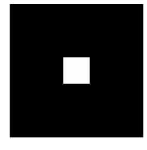
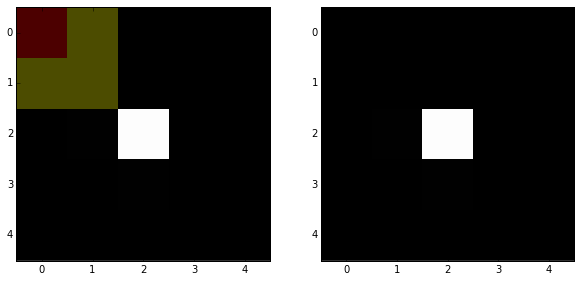
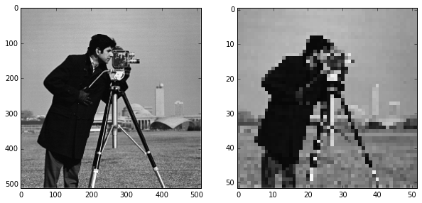
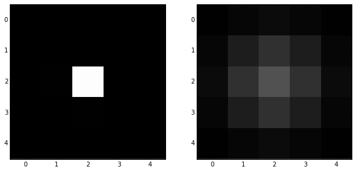
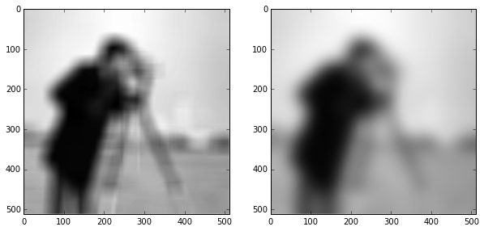
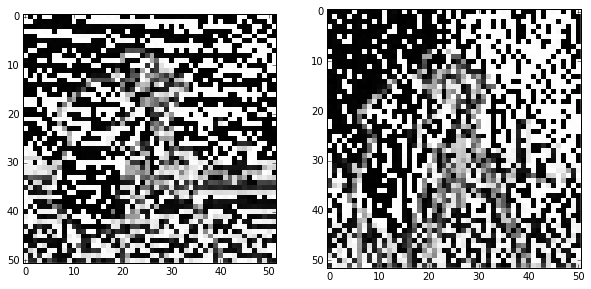
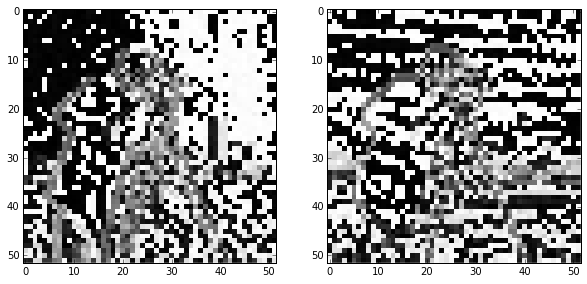
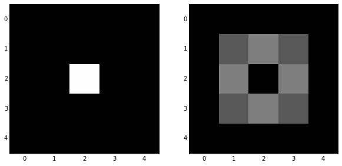
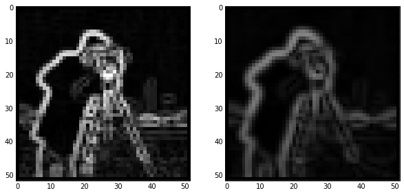
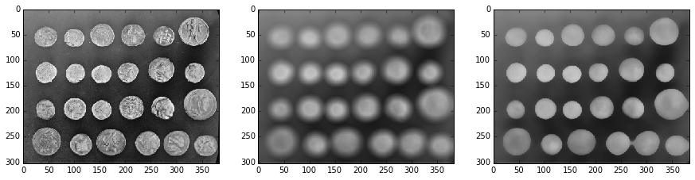

# Image filtering

## Image filtering theory

Filtering is one of the most basic and common image operations in image
processing. You can filter an image to remove noise or to enhance features; the
filtered image could be the desired result or just a preprocessing step.
Regardless, filtering is an important topic to understand.

### Local filtering

Let's get started by importing the helper module, `skdemo`, used in the previous
section.

    import skdemo

The "local" in local filtering simply means that a pixel is adjusted by values
in some surrounding neighborhood. These surrounding elements are identified or
weighted based on a "footprint", "structuring element", or "kernel".

Let's start with an incredibly simple image:

    import numpy as np
    
    bright_pixel = np.zeros((5, 5), dtype=float)
    bright_pixel[2, 2] = 1
    print bright_pixel
    skdemo.imshow(bright_pixel)

    [[ 0.  0.  0.  0.  0.]
     [ 0.  0.  0.  0.  0.]
     [ 0.  0.  1.  0.  0.]
     [ 0.  0.  0.  0.  0.]
     [ 0.  0.  0.  0.  0.]]

For our first example of a filter, consider the following array, which we'll
call a "mean kernel":

    mean_kernel = 1.0/9.0 * np.ones((3, 3))
    
    print mean_kernel

    [[ 0.11111111  0.11111111  0.11111111]
     [ 0.11111111  0.11111111  0.11111111]
     [ 0.11111111  0.11111111  0.11111111]]

Now, lets take our mean kernel and apply it to every pixel of the image.

Applying a (linear) filter essentially means:
* Center a kernel on a pixel
* Multiply the pixels *under* that kernel by the values *in* the kernel
* Sum all the those results
* Replace the center pixel with the summed result

This process is known as convolution.

    skdemo.mean_filter_interactive_demo(bright_pixel)

Let's take a look at the numerical result:

    from scipy.ndimage import convolve
    
    smooth = convolve(bright_pixel, mean_kernel)
    print smooth

    [[ 0.          0.          0.          0.          0.        ]
     [ 0.          0.11111111  0.11111111  0.11111111  0.        ]
     [ 0.          0.11111111  0.11111111  0.11111111  0.        ]
     [ 0.          0.11111111  0.11111111  0.11111111  0.        ]
     [ 0.          0.          0.          0.          0.        ]]

The meaning of "mean kernel" should be clear now: Each pixel was replaced with
the mean value within the 3x3 neighborhood of that pixel. Any time the kernel
was over the bright pixel, the pixel in the kernel's center was changed to 1/9
(= 0.111). (There's only 1 non-zero pixel, so that's the maximum sum.) Anywhere
else, the result was 0.

This filter produced two important results:
1. The intensity of the bright pixel decreased.
2. The intensity of the region near the bright pixel increased.

Slight aside:

    print mean_kernel.sum()

    1.0

Note that all the values of the kernel sum to 1. Why might that be important?

### Downsampled image

Let's consider a real image now. It'll be easier to see some of the filtering
we're doing if downsample the image a bit. We can slice into the image using the
"step" argument to sub-sample it:

    from skimage import data
    
    image = data.camera()
    pixelated = image[::10, ::10]
    skdemo.imshow_all(image, pixelated)

Here we use a step of 10, giving us every 10 columns and every 10 rows of the
original image. You can see the highly pixelated result on the right.

### Mean filter on a real image

Now we can apply the filter to this downsampled image:

    filtered = convolve(pixelated, mean_kernel)
    skdemo.imshow_all(pixelated, filtered)

Comparing the filtered image to the pixelated image, we can see that this
filtered result is smoother: Sharp edges (which are just borders between dark
and bright pixels) are smoothed because dark pixels reduce the intensity of
neighboring pixels and bright pixels do the opposite.

## Essential filters

If you read through the last section, you're already familiar with the essential
concepts of image filtering. But, of course, you don't have to create custom
filter kernels for all of your filtering needs.

### Gaussian filter

The classic image filter is the Gaussian filter. This is similar to the mean
filter, in that it tends to smooth images. The Gaussian filter, however, doesn't
weight all values in the neighborhood equally. Instead, pixels closer to the
center are weighted more than those farther away.

    from skimage import filter
    
    smooth = filter.gaussian_filter(bright_pixel, 1)
    skdemo.imshow_all(bright_pixel, smooth, vmax=0.5)

For a real image, we get the following:

    from skimage import img_as_float
    # The Gaussian filter returns a float image, regardless of input.
    # Cast to float so the images have comparabale intensity ranges.
    pixelated_float = img_as_float(pixelated)
    smooth = filter.gaussian_filter(pixelated_float, 1)
    skdemo.imshow_all(pixelated_float, smooth)

This doesn't look drastically different than the mean filter, but the Gaussian
filter is typically preferred because of the distance-dependent weighting. For a
more detailed image and a larger filter, you can see artifacts in the mean
filter since it doesn't take distance into account:

    size = 20
    structuring_element = np.ones((2*size + 1, 2*size + 1))
    smooth_mean = filter.rank.mean(image, structuring_element)
    smooth_gaussian = filter.gaussian_filter(image, size)
    skdemo.imshow_all(smooth_mean, smooth_gaussian)

### Basic edge filtering

For images, you can think of an edge as points where the gradient is large in
one direction. If you're familiar with numerical analysis, gradients can be
approximated as differences in neighboring values. There are many ways to
compute intensity differences between neighboring pixels (by weighting neighbors
differently). At it simplest, you can just subtract one neighbor from the other.

    horizontal_edges = pixelated[1:, :] - pixelated[:-1, :]
    vertical_edges = pixelated[:, 1:] - pixelated[:, :-1]

    skdemo.imshow_all(horizontal_edges, vertical_edges)

That's obviously not what we were hoping for: It all looks like noise. What's
wrong here?

In addition to the more obvious issues above, this operation has two additional
issues, which can be seen below:

    horizontal_edges = bright_pixel[1:, :-1] - bright_pixel[:-1, :-1]
    vertical_edges = bright_pixel[:-1, 1:] - bright_pixel[:-1, :-1]
    skdemo.imshow_all(horizontal_edges, vertical_edges)

Note here that:
1. The shape of the image isn't preserved
2. The operation skews edges to one corner of the image.

This difference operation gives the gradient *in-between* pixels, but we
typically want the gradient at the same pixels as the original image.

## Exercise:

Create a simple difference filter to find the horizontal or vertical edges of an
image. Try to ensure that the filtering operation doesn't shift the edge
position preferentially.

This should get you started:

    # Replace the kernels below with your difference filter
    # `ones` is used just for demonstration and your kernel should be larger than (1, 1)
    horizontal_edge_kernel = np.array([[1, 0, -1]]) #np.ones((1, 1))
    vertical_edge_kernel = np.array([[1], [0], [-1]]) #np.ones((1, 1))
    
    # As discussed earlier, you may want to replace pixelated with a different image.
    image = pixelated
    horizontal_edges = convolve(image, horizontal_edge_kernel)
    vertical_edges = convolve(image, vertical_edge_kernel)
    skdemo.imshow_all(horizontal_edges, vertical_edges)

### Sobel edge filter

The standard Sobel filter gives the gradient magnitude. This is similar to what
we saw above, except that horizontal and vertical components are combined such
that the direction of the gradient is ignored.

To address the issues described above, the Sobel kernel will produce a strong
response if values above the center are very different than those below the
center. In contrast, if the values above the center pixel are exactly equal to
those below it, then responses exactly cancel each other and  this kernel
replaces the center pixel with a 0.

    skdemo.imshow_all(bright_pixel, filter.sobel(bright_pixel))

Like any derivative, noise can have a strong impact on the result:

    pixelated_edges = filter.sobel(pixelated)
    skdemo.imshow_all(pixelated, pixelated_edges)

Smoothing is often used as a preprocessing step in preparation for feature
detection and image-enhancement operations because sharp features can distort
results.

    edges = filter.sobel(smooth)
    skdemo.imshow_all(pixelated_edges, edges)

Notice how the legs of the tripod shows up as a series of rings before
smoothing, while the smoothed input produces legs that are much more linear.

## Exercise:

Using a couple of the filters in the `filter` module, find the direction of the
maximum gradient in an image.

## Denoising filters

This is a bit arbitrary, but here, we distinguish smoothing filters from
denoising filters. We'll label denoising filters as those that are edge
preserving.

As you can see from our earlier examples, mean and Gaussian filters smooth an
image rather uniformly, including the edges of objects in an image. When
denoising, however, you typically want to preserve features and just remove
noise. The distinction between noise and features can, of course, be highly
situation dependent and subjective.

### Median Filter

The median filter is the classic edge-preserving filter. As the name implies,
this filter takes a set of pixels and returns a median value. Because regions
near a sharp edge will have many dark values and many light values, but few
values in between, the median at an edge will be either light or dark---not some
value in between. In that way, we don't end up with edges that are smoothed.

    from skimage.morphology import disk
    selem = disk(1)  # "selem" is often the name used for "structuring element"
    denoised = filter.rank.median(pixelated, selem)
    skdemo.imshow_all(pixelated, smooth, denoised)

This difference is more noticeable with a more complicated image.

    selem = disk(10)
    image = data.coins()
    smooth = filter.rank.mean(image, selem)
    denoised = filter.rank.median(image, selem)
    skdemo.imshow_all(image, smooth, denoised)

## Further reading

`scikit-image` also provides more sophisticated denoising filters:

    from skimage.restoration import denoise_tv_bregman
    denoised = denoise_tv_bregman(pixelated, 5)
    skdemo.imshow_all(pixelated, smooth, denoised)

* [Denoising examples](http://scikit-
image.org/docs/dev/auto_examples/plot_denoise.html)
* [Rank filters example](http://scikit-
image.org/docs/dev/auto_examples/applications/plot_rank_filters.html)
