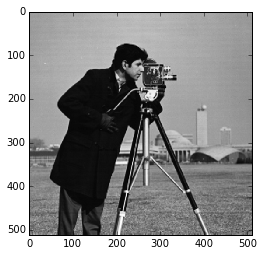
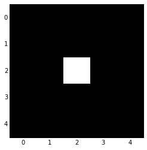
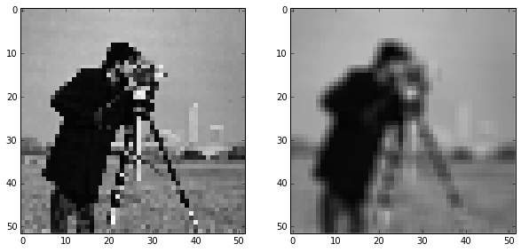
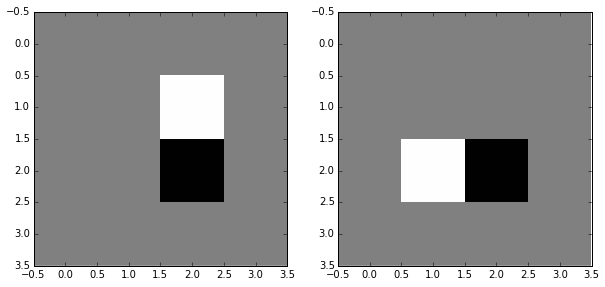
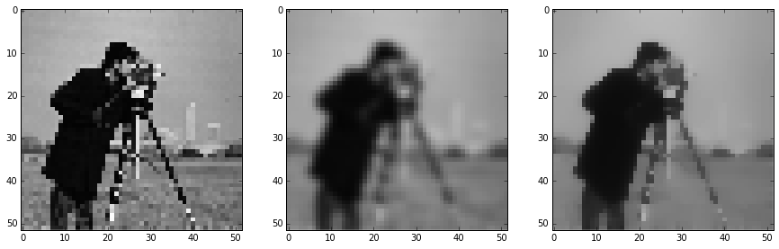

# Image filtering

## Setup: Create a pixelated image

    from skimage import io
    from skimage import data
    image = data.camera()
    io.imshow(image)

### Slice steps

Continuing with the slicing fun, we can use the "step" slice-argument to sub-
sample an image, so that its one-tenth of the original:

    import skdemo
    pixelated = image[::10, ::10]
    skdemo.imshow_all(image, pixelated)

## Image filtering theory

Filtering is one of the most basic and common image operations in image
processing. You can filter an image to remove noise or to enhance features; the
filtered image could be the desired result or just a preprocessing step.
Regardless, filtering is an important topic to understand.

### Local filtering

The "local" in local filtering simply means that a pixel is adjusted by values
in some surrounding neighborhood. Values of surrounding elements are identified
or weighted based on a "footprint", "structuring element", or "kernel".

Let's consider the following array, which we'll call a "mean kernel":

    mean_kernel = 1.0/9.0 * np.ones((3, 3))
    
    print mean_kernel

    [[ 0.11111111  0.11111111  0.11111111]
     [ 0.11111111  0.11111111  0.11111111]
     [ 0.11111111  0.11111111  0.11111111]]

    bright_pixel = np.zeros((5, 5), dtype=float)
    bright_pixel[2, 2] = 1
    print bright_pixel
    io.imshow(bright_pixel)

    [[ 0.  0.  0.  0.  0.]
     [ 0.  0.  0.  0.  0.]
     [ 0.  0.  1.  0.  0.]
     [ 0.  0.  0.  0.  0.]
     [ 0.  0.  0.  0.  0.]]

Now, lets take our mean kernel and apply it to every pixel of the image. This
essentially means centering the kernel on a pixel, multiplying the pixels
*under* that kernel by the values *in* the kernel, summing all the results, and
replacing the center pixel with the summed result. That process is known as
convolution, which gives the following:

    reload(skdemo)
    skdemo.mean_filter_interactive_demo(bright_pixel)

Two things happened here:
1. The intensity of the bright pixel decreased.
2. The intensity of the region near the bright pixel increased.

We can see numerical result by printing the image:

    from scipy.ndimage import convolve
    
    smooth = convolve(bright_pixel, mean_kernel)
    print smooth

    [[ 0.          0.          0.          0.          0.        ]
     [ 0.          0.11111111  0.11111111  0.11111111  0.        ]
     [ 0.          0.11111111  0.11111111  0.11111111  0.        ]
     [ 0.          0.11111111  0.11111111  0.11111111  0.        ]
     [ 0.          0.          0.          0.          0.        ]]

Any time the kernel was over the bright pixel, the pixel in the kernel's center
was changed to 1/9 (= 0.111). (There's only 1 non-zero pixel, so that's the
maximum sum.) Anywhere else, the result was 0.

We can see a more realistic result by applying this filter to our pixelated
image:

    filtered = convolve(pixelated, mean_kernel)
    skdemo.imshow_all(pixelated, filtered)

Comparing this to the pixelated image, we can see that this filtered result is
smoother: Sharp edges (which are just borders between dark and bright pixels)
are smoothed because dark pixels reduce the intensity of neighboring pixels and
bright pixels do the opposite.

## Image filtering

If you read through the last section, you're already familiar with the essential
concepts of image filtering. But, of course, you don't have to create custom
filter kernels for all of your filtering needs.

### Gaussian filter

The classic image filter is the Gaussian filter. In contrast to the mean filter,
we don't weight all values in the neighborhood equally. Instead, pixels closer
to the center are weighted more than those farther away.

    from skimage import filter
    
    smooth = filter.gaussian_filter(bright_pixel, 1)
    skdemo.imshow_all(bright_pixel, smooth, vmax=0.5)

Now let's try this on a real image:

    from skimage import img_as_float
    # The Gaussian filter returns a float image, regardless of input.
    # Cast to float so the images have comparabale intensity ranges.
    pixelated_float = img_as_float(pixelated)
    smooth = filter.gaussian_filter(pixelated_float, 1)
    skdemo.imshow_all(pixelated_float, smooth)

This doesn't look drastically different than the mean filter, but the Gaussian
filter often performs better because of the distance-dependent weighting.

### Edge filtering

For images, you can think of an edge as points where the gradient is large. If
you're familiar with  can be approximated as differences in neighboring values.
There a many ways to compute intensity differences between neighboring pixels
(by weighting neighbors differently). At it simplest, you can just subtract one
neighbor from the other.

    horizontal_edges = pixelated[1:, :] - pixelated[:-1, :]
    vertical_edges = pixelated[:, 1:] - pixelated[:, :-1]
    skdemo.imshow_all(horizontal_edges, vertical_edges)

    horizontal_edges = bright_pixel[1:, :-1] - bright_pixel[:-1, :-1]
    vertical_edges = bright_pixel[:-1, 1:] - bright_pixel[:-1, :-1]
    skdemo.imshow_all(horizontal_edges, vertical_edges)

## Exercise:

Create a simple difference convolution filter to find the horizontal or vertical
edges of an image. Try to ensure that the filtering operation doesn't shift the
edge position preferentially.

#### Sobel kernel (edge filter)

This Sobel kernel will produce a strong response if values above the center are
very different than those below the center. In contrast, if the values above the
center pixel are exactly equal to those below it, then responses exactly cancel
each other and  this kernel replaces the center pixel with a 0.

    skdemo.imshow_all(bright_pixel, filter.sobel(bright_pixel))

Like any derivative, noise can have a strong impact on the result:

    edges = filter.sobel(pixelated)
    skdemo.imshow_all(pixelated, edges)

Smoothing is often used as a preprocessing step in preparation for feature
detection and image-enhancement operations because sharp features can distort
results. Edge filtering is one example, since edges correspond to strong
gradients in an image.

    edges = filter.sobel(smooth)
    skdemo.imshow_all(smooth, edges)

Notice how the legs of the tripod shows up as a series of rings in the first
pair of images, while the smoothed input produces legs that are much more
linear.

## Exercise:

Using a couple of the filters in the `filter` module, find the direction of the
maximum gradient in an image.

### Denoising filters

This is a bit arbitrary, but here, we distinguish smoothing filters from
denoising filters. We'll label denoising filters as those that are edge
preserving. As you can see from our earlier examples, mean and Gaussian filters
smooth an image rather uniformly, including the edges of objects in an image.
When denoising, however, you typically want to preserve features and just remove
noise. The distinction between noise and features can, of course, be highly
situation dependent and subjective.

#### Median Filter

The median filter is the classic edge-preserving filter. As the name implies,
this filter takes a set of pixels and returns a median value. Because regions
near a sharp edge will have many dark values and many light values, but few
values in between, the median at an edge will be either light or dark---not some
value in between. In that way, we don't end up with edges that are smoothed.

    from skimage.morphology import disk
    selem = disk(1)  # "selem" is often the name used for "structuring element"
    denoised = filter.rank.median(pixelated, selem)
    skdemo.imshow_all(pixelated, smooth, denoised)

    from skimage.restoration import denoise_tv_bregman
    denoised = denoise_tv_bregman(pixelated, 5)
    skdemo.imshow_all(pixelated, smooth, denoised)

## Further reading

* [Denoising examples](http://scikit-
image.org/docs/dev/auto_examples/plot_denoise.html)
* [Rank filters example](http://scikit-
image.org/docs/dev/auto_examples/applications/plot_rank_filters.html)
