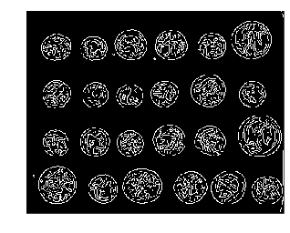
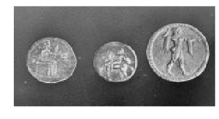
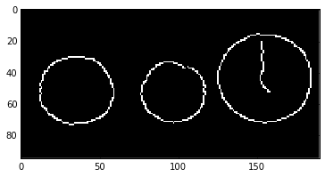
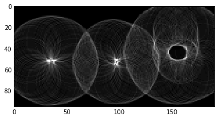

# Feature detection

## Edge detection

We've already discussed edge filtering in the image filtering section. In that
dicussion, however, we got back a grayscale image, which essentially tells us
the likelihood whether a pixel is on the edge of an object. We can apply a bit
more logic to *detect* an edge; i.e. we can use that filtered image to make a
*decision* whether or not a pixel is on an edge.

### Canny edge detector

The Canny filter is the classic edge detector. It reuses the Sobel filter, which
we saw earlier:

    import skdemo
    from skimage import data, filter
    
    image = data.camera()
    pixelated = image[::10, ::10]
    edges = filter.sobel(pixelated)
    skdemo.imshow_all(pixelated, edges)

The Canny filter combines the Sobel filter with few other steps to give a binary
edge image. The steps are as follows:
* Gaussian filter
* Sobel filter
* Non-maximal suppression
* Hysteresis thresholding

Let's go through these steps one at a time.

### Step 1: Gaussian filter

As mentioned earlier, gradients tend to enhance noise. To combat this effect, we
first smooth the image using a gradient filter:

    from skimage import img_as_float
    
    sigma = 1  # Standard-deviation of Gaussian; larger smooths more.
    pixelated_float = img_as_float(pixelated)
    pixelated_float = pixelated
    smooth = filter.gaussian_filter(pixelated_float, sigma)
    skdemo.imshow_all(pixelated_float, smooth)

### Step 2: Sobel filter

Next, we apply our edge filter:

    gradient_magnitude = filter.sobel(smooth)
    skdemo.imshow_all(smooth, gradient_magnitude)

### Step 3: Non-maximal suppression

Ideally, an edge is a thin: In some sense, an edge is infinitely thin, but
images are discrete so we want edges to be a single pixel wide. To accomplish
this, we thin the image using "non-maximal suppression". This takes the edge-
filtered image and thins the response across the edge direction; i.e. in the
direction of the maximum gradient:

    zoomed_grad = gradient_magnitude[15:25, 5:15]
    maximal_mask = np.zeros_like(zoomed_grad)
    # This mask is made up for demo purposes
    maximal_mask[range(10), (7, 6, 5, 4, 3, 2, 2, 2, 3, 3)] = 1
    grad_along_edge = maximal_mask * zoomed_grad
    skdemo.imshow_all(zoomed_grad, grad_along_edge, limits='dtype')

Thus, an edge is only possible if there are no better edges near it.

### Step 4: Hysteresis thresholding

The final step is the actual decision-making process. Here, we have two
parameters: The low threshold and the high threshold. The high threshold sets
the gradient value that you *know* is definitely an edge. The low threshold sets
the gradient value that could be an edge, but only if it's connected to a pixel
that we know is an edge.

These two thresholds are displayed below:

    from skimage import color
    
    low_threshold = 0.2
    high_threshold = 0.3
    label_image = np.zeros_like(pixelated)
    # This uses `gradient_magnitude` which has gone through non-maximal-suppression.
    label_image[gradient_magnitude > low_threshold] = 1
    label_image[gradient_magnitude > high_threshold] = 2
    demo_image = color.label2rgb(label_image, gradient_magnitude,
                                 bg_label=0, colors=('yellow', 'red'))
    skdemo.imshow(demo_image)

The red points here are above `high_threshold` and are seed points for edges.
The red points are edges if connected to seed points; i.e. isolated groups of
yellow points will not be detected as edges.

### The Canny edge detector

Now we're ready to look at the actual result:

    from IPython.html import widgets
    from skimage import data
    
    image = data.coins()
    
    def canny_demo(**kwargs):
        edges = filter.canny(image, **kwargs)
        skdemo.imshow(edges)
        plt.show()
    widgets.interact(canny_demo); 

Play around with the demo above. Make sure to add any free parameters to
`interact` that might be necessary.

Can you describe how the low threshold makes a decision about a potential edge,
as compared to the high threshold?

## Aside: Feature detection in research

When taking image data for an experiment, the end goal is often to detect some
sort of feature.

### Feature detection: case study

I got started with image processing when I needed to detect a device I built to
study swimming at low-Reynolds numbers:

    from IPython.display import Image, YouTubeVideo
    
    YouTubeVideo('1Pjlj9Pymx8')

        <iframe
            width="400"
            height=300"
            src="https://www.youtube.com/embed/1Pjlj9Pymx8"
            frameborder="0"
            allowfullscreen
        ></iframe>
        

### Particle detection

For my post-doc, I ended up investigating the collection fog from the
environment and built apparatus displayed below:

    from IPython.display import Image, YouTubeVideo
    
    Image(filename='images/fog_tunnel.png')

The resulting experiments looked something like this:

    YouTubeVideo('14qlyhnyjT8')

        <iframe
            width="400"
            height=300"
            src="https://www.youtube.com/embed/14qlyhnyjT8"
            frameborder="0"
            allowfullscreen
        ></iframe>
        

The water droplets in the video can be detected using some of the features in
`scikit-image`. In particular, `peak_local_max` from the `feature` package is
useful here. There's a bit more work to get subpixel accuracy, but that function
can get you most of the way there:

    Image(filename='images/particle_detection.png')

### Circle detection

If we look at the previous video over a longer period of time (time-lapsed),
then we can see droplets accumulating on the surface:

    YouTubeVideo('_qeOggvx5Rc')

        <iframe
            width="400"
            height=300"
            src="https://www.youtube.com/embed/_qeOggvx5Rc"
            frameborder="0"
            allowfullscreen
        ></iframe>
        

Instead of looking at the substrate from the side, the microscope objective was
moved to a top-down view on the substrate in the video below:

    YouTubeVideo('8utP9Ju_rdc')

        <iframe
            width="400"
            height=300"
            src="https://www.youtube.com/embed/8utP9Ju_rdc"
            frameborder="0"
            allowfullscreen
        ></iframe>
        

At the time, I was interested in figuring out how droplet sizes evolved. To
accomplish that, we could open up each frame in some image-analysis software and
manually measure each drop size. That becomes pretty tediuous, pretty quickly.
Using feature-detection techniques, we can get a good result with significantly
less effort.

    Image(filename='images/circle_detection.png')

In case you're wondering about the differences between the flat (lower) and
textured (upper) surfaces pictured above, the circle measurements were used to
describe the difference in growth, which is summarized below:

    Image(filename='images/power_law_growth_regimes.png')

## Hough transforms

Hough transforms are a general class of operations that make up a step in
feature detection. Just like we saw with edge detection, Hough transforms
produce a result that we can use to detect a feature. (The distinction between
the "filter" that we used for edge detection and the "transform" that we use
here is a bit arbitrary.)

### Circle detection

To explore the Hough transform, let's take the circular Hough transform as our
example.

To get started, let's use an image with some circles:

    image = data.coins()[0:95, 180:370]
    skdemo.imshow(image)

We can use the Canny edge filter to get a pretty good representation of these
circles:

    edges = filter.canny(image, sigma=3, low_threshold=10, high_threshold=50)
    plt.imshow(edges);

While it looks like we've extracted circles, this doesn't give us much if what
we want to do is *measure* these circles. For, example, what's the size and
position of the circles in the above image? The edge image doesn't really tell
us much about that.

Let's just jump into using the Hough transform:

    from skimage.transform import hough_circle
     
    hough_radii = np.arange(15, 30, 2)
    hough_response = hough_circle(edges, hough_radii)

Here, the circular Hough transform actually uses the edge image from before. We
also have to define the radii that we want to search for in our image.

So... what's that actual result that we get back?

    print edges.shape,
    print hough_response.shape

    (95, 190) (8, 95, 190)

We can see that the last two dimensions of the response are exactly the same as
the original image; so the response is image-like. Then what's the first
dimension correspond to?

As always, you can get a better feel for the result by plotting it:

    h_max = hough_response.max()
    
    def hough_responses_demo(i):
        # Use `plt.title` to add a meaningful title for each index.
        plt.imshow(hough_response[i, :, :], vmax=h_max*0.5)
        plt.show()
    widgets.interact(hough_responses_demo, i=(0, len(hough_response)-1));

Playing around with the slider should give a pretty good feel for the result.

This Hough transform simply counts the pixels in a thin (as opposed to filled)
circular mask. Since the input is an edge image, the response is strongest when
the center of the circular mask lies at the center of a circle with the same
radius.

## Exercise:

Use the response from the Hough transform to detect the positions and radius of
each coin.

    from skimage.feature import peak_local_max
    from skimage.draw import circle_perimeter
    
    centers = []
    likelihood = []
    # Your code here

The same concept described in this section can be applied to line detection,
ellipse detection, and various other features of interest.

## Blobs

Maybe skip this?

## Further reading

### Interest point detection

We've only skimmed the surface of what might be classified as "feature
detection". One major area that we haven't covered is called [interest point
detection](http://en.wikipedia.org/wiki/Interest_point_detection). Here, we
don't even need to know what we're looking for, we just identify small patches
(centered on a pixel) that are distinct. These distinct points can then be used
to, e.g., compare with distinct points in other images.

One common use of interest point detection is for image registration, in which
we align (i.e. "register") images based on interest points. Here's an example of
the [CENSURE feature detector from the gallery](http://scikit-
image.org/docs/dev/auto_examples/plot_censure.html):

    Image(filename='images/censure_example.png')

* [Probabilistic Hough transform](http://scikit-
image.org/docs/dev/auto_examples/plot_line_hough_transform.html)
* [Circular and elliptical Hough transforms](http://scikit-
image.org/docs/dev/auto_examples/plot_circular_elliptical_hough_transform.html)
* [Template matching](http://scikit-
image.org/docs/dev/auto_examples/plot_template.html)
* [Histogram of Oriented Gradients](http://scikit-
image.org/docs/dev/auto_examples/plot_hog.html)
* [BRIEF](http://scikit-image.org/docs/dev/auto_examples/plot_brief.html),
[CENSURE](http://scikit-image.org/docs/dev/auto_examples/plot_censure.html), and
[ORB](http://scikit-image.org/docs/dev/auto_examples/plot_orb.html) feature
detectors/descriptors
* [Robust matching using RANSAC](http://scikit-
image.org/docs/dev/auto_examples/plot_matching.html)
