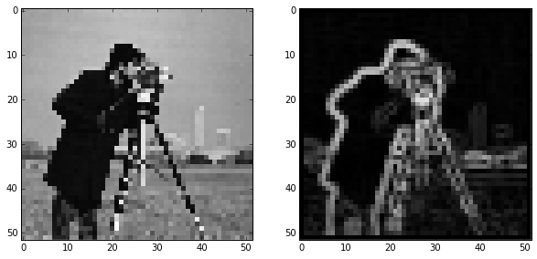
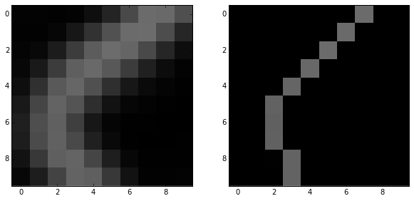
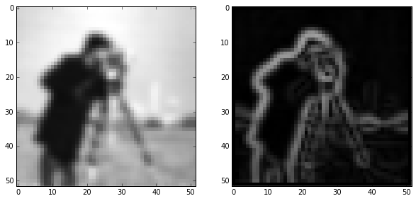
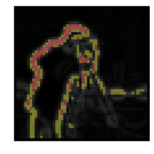
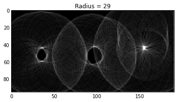
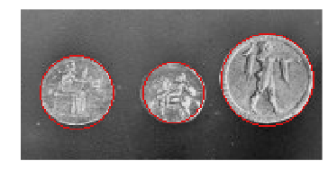

# Feature detection

## Edges

### Canny filter

Earlier, we saw the Sobel filter, which give the gradient magnitude of an image:

    import skdemo
    reload(skdemo)
    from skimage import data, filter
    
    image = data.camera()
    pixelated = image[::10, ::10]
    edges = filter.sobel(pixelated)
    skdemo.imshow_all(pixelated, edges)

The Canny filter combines the Sobel filter with few other steps to give a binary
edge image. The steps are as follows:
* Gaussian filter
* Sobel filter
* Non-maximal suppression
* Hysteresis thresholding

### Gaussian filter

    from skimage import img_as_float
    
    sigma = 1  # Standard-deviation of Gaussian; larger smooths more.
    pixelated_float = img_as_float(pixelated)
    smooth = filter.gaussian_filter(pixelated_float, sigma)
    skdemo.imshow_all(pixelated_float, smooth)

### Sobel filter

    gradient_magnitude = filter.sobel(smooth)
    skdemo.imshow_all(smooth, gradient_magnitude)

### Non-maximal suppression

    zoomed_grad = gradient_magnitude[15:25, 5:15]
    maximal_mask = np.zeros_like(zoomed_grad)
    # This mask is made up for demo purposes
    maximal_mask[range(10), (7, 6, 5, 4, 3, 2, 2, 2, 3, 3)] = 1
    grad_along_edge = maximal_mask * zoomed_grad
    skdemo.imshow_all(zoomed_grad, grad_along_edge, limits='dtype')

### Hysteresis thresholding

    from skimage import color
    
    low_threshold = 0.2
    high_threshold = 0.3
    label_image = np.zeros_like(pixelated)
    # This uses `gradient_magnitude` which has gone through non-maximal-suppression.
    label_image[gradient_magnitude > low_threshold] = 1
    label_image[gradient_magnitude > high_threshold] = 2
    demo_image = color.label2rgb(label_image, gradient_magnitude, bg_label=0,
                    colors=('yellow', 'red'))
    skdemo.imshow(demo_image)

The blue points here are above `high_threshold` and are seed points for edges.
The red points are edges if connected to seed points; i.e. isolated groups of
red points will not be detected as edges.

### The Canny filter

    from IPython.html import widgets
    from skimage import data
    
    image = data.coins()
    
    def canny_demo(**kwargs):
        edges = filter.canny(image, **kwargs)
        skdemo.imshow(edges)
        plt.show()
    widgets.interact(canny_demo, sigma=(1, 10)) 

## Corners

    

## Feature detection in research

    from IPython.display import Image, YouTubeVideo
    
    Image(filename='images/fog_tunnel.png')

    YouTubeVideo('14qlyhnyjT8', autoplay=True)

        <iframe
            width="400"
            height=300"
            src="https://www.youtube.com/embed/14qlyhnyjT8?autoplay=True"
            frameborder="0"
            allowfullscreen
        ></iframe>
        

    Image(filename='images/particle_detection.png')

    YouTubeVideo('_qeOggvx5Rc', autoplay=True)

        <iframe
            width="400"
            height=300"
            src="https://www.youtube.com/embed/_qeOggvx5Rc?autohide=True&autoplay=True"
            frameborder="0"
            allowfullscreen
        ></iframe>
        

Instead of looking at the substrate from the side, the microscope objective is
moved to a top-down view on the substrate in the video below:

    YouTubeVideo('8utP9Ju_rdc', autoplay=True)

        <iframe
            width="400"
            height=300"
            src="https://www.youtube.com/embed/8utP9Ju_rdc?autoplay=True"
            frameborder="0"
            allowfullscreen
        ></iframe>
        

    Image(filename='images/circle_detection.png')

## Hough transforms

### Circle detection

    image = data.coins()[0:95, 180:370]
    skdemo.imshow(image)

    edges = filter.canny(image, sigma=3, low_threshold=10, high_threshold=50)
    plt.imshow(edges)

    <matplotlib.image.AxesImage at 0x10ef644d0>

    from skimage.transform import hough_circle
     
    hough_radii = np.arange(15, 30, 2)
    hough_response = hough_circle(edges, hough_radii)
    h_max = hough_response.max()
    
    def hough_responses_demo(i):
        plt.title('Radius = {}'.format(hough_radii[i]))
        plt.imshow(hough_response[i, :, :], vmax=h_max*0.5)
        plt.show()
    widgets.interact(hough_responses_demo, i=(0, len(hough_response)-1))

## Exercise:

Use the response from the Hough transform to detect the positions and radius of
each coin.

    from skimage.feature import peak_local_max
    from skimage.draw import circle_perimeter
    
    image = data.coins()[0:95, 180:370]
    
    centers = []
    accums = []
    
    for h in hough_response:
        peaks = peak_local_max(h, num_peaks=1)
        centers.extend(peaks)
        accums.extend(h[peaks[:, 0], peaks[:, 1]])
    
    # Draw a red circle for the 3 most prominent Hough responses
    circled_image = color.gray2rgb(image)
    for idx in np.argsort(accums)[::-1][:3]:
        center_x, center_y = centers[idx]
        cx, cy = circle_perimeter(center_y, center_x, hough_radii[idx])
        circled_image[cy, cx] = (220, 20, 20)
    
    skdemo.imshow(circled_image)

### Line detection

## Blobs

## Further reading

* Probabilistic Hough transform
* [Circular and elliptical Hough transforms](http://scikit-
image.org/docs/dev/auto_examples/plot_circular_elliptical_hough_transform.html)
* [Template matching](http://scikit-
image.org/docs/dev/auto_examples/plot_template.html)
* [Histogram of Oriented Gradients](http://scikit-
image.org/docs/dev/auto_examples/plot_hog.html)
* [BRIEF](http://scikit-image.org/docs/dev/auto_examples/plot_brief.html),
[CENSURE](http://scikit-image.org/docs/dev/auto_examples/plot_censure.html), and
[ORB](http://scikit-image.org/docs/dev/auto_examples/plot_orb.html) feature
detectors/descriptors
* [Robust matching using RANSAC](http://scikit-
image.org/docs/dev/auto_examples/plot_matching.html)
